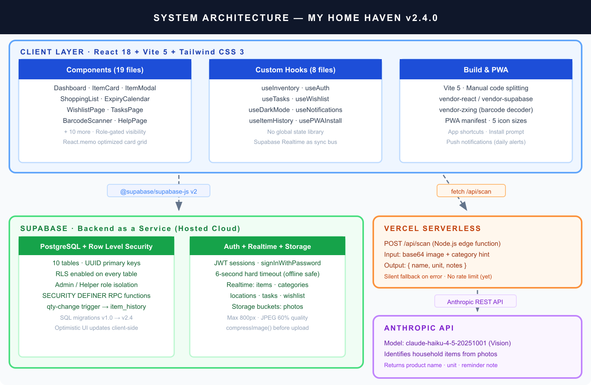
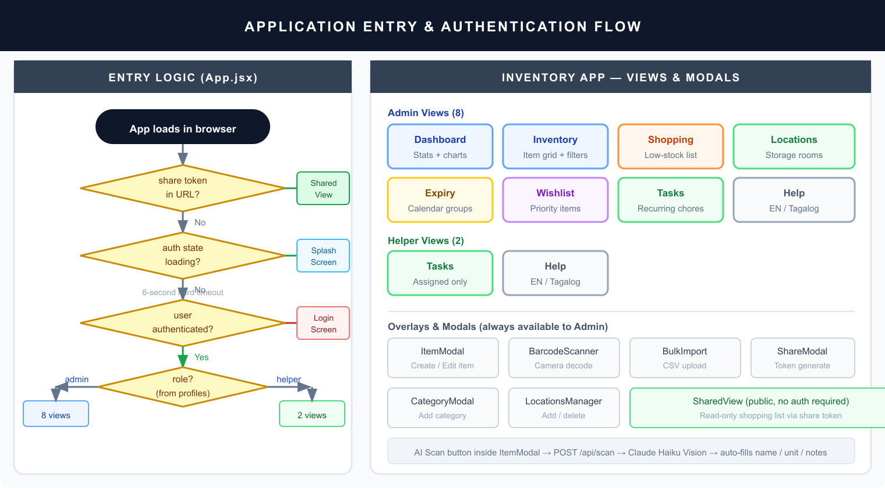
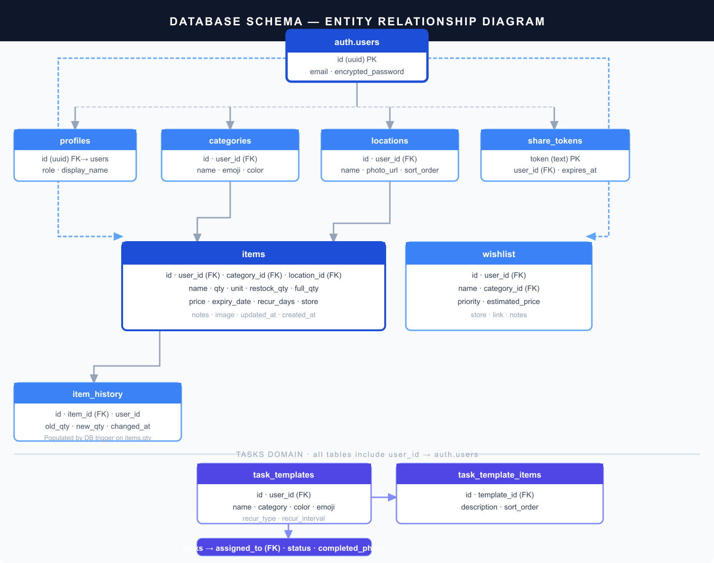

| | |
|---|---|
| **Project** | My Home Haven - Household Inventory PWA |
| **Current Version** | 2.6.0 |
| **Document Status** | Living Document - updated with every release |
| **Last Updated** | 29 March 2026 |
| **Author** | Development Team |

---

## Executive Summary

My Home Haven is a production-ready Progressive Web App (PWA) for household inventory management. It enables multi-user, real-time tracking of pantry items, household supplies, and recurring chores across devices. The system is built on React 18 with a Supabase backend, deployed to Vercel, and enhanced with AI-powered item identification via the Anthropic Claude API.

The application supports two user roles — Admin (full inventory control) and Helper (task-only access) — and delivers a mobile-first experience installable to the home screen on both iOS and Android.

---

## 1. Background and Context

### 1.1 Problem Statement

Households struggle to maintain consistent awareness of what they have in stock, what needs restocking, what is expiring soon, and who is responsible for recurring tasks. Existing solutions are too complex, require manual syncing, or lack real-time collaboration between household members.

### 1.2 Target Users

| User | Role | Primary Need |
|------|------|-------------|
| Primary household manager | Admin | Track inventory, shopping, and manage the household |
| Family member / helper | Helper | View and complete assigned chores |
| Guest / visitor | Public via share link | View shopping list without an account |

### 1.3 Project Constraints

- No dedicated backend server — BaaS-only (Supabase)
- Must be installable as a PWA on iOS and Android
- Must work across mobile and desktop browsers
- Cost target: free tier infrastructure

---

## 2. Goals and Non-Goals

### 2.1 In Scope

- Inventory CRUD with categories, locations, and custom fields
- Real-time multi-device synchronization
- Expiry date tracking with visual alerts
- Smart shopping list auto-populated from low-stock items
- Recurring household task management with photo completion proof
- Barcode scanning and AI-powered item identification
- CSV bulk import and export
- Read-only shareable shopping list links
- Browser push notifications for low-stock alerts
- Dark mode

### 2.2 Out of Scope

| Feature | Reason Excluded |
|---------|----------------|
| Recipe management | Out of product scope |
| E-commerce / ordering integration | Complexity, cost |
| Voice commands | Future consideration |
| Offline-first with service worker cache | Not required for current scale |
| Multi-household / multi-tenant | Requires architecture change |
| Nutrition tracking | Out of product scope |

### 2.3 Assumptions

- Users have a modern browser (Chrome 90+, Safari 14+, Firefox 88+)
- Supabase free tier capacity is sufficient for household scale
- No more than approximately 5 concurrent users per household

---

## 3. System Architecture

### 3.1 High-Level Architecture Diagram

### 3.2 Architecture Decisions and Rationale

| Decision | Chosen Approach | Alternatives Considered | Rationale |
|----------|----------------|------------------------|-----------|
| **Backend** | Supabase (BaaS) | Firebase, custom Express API | Free tier PostgreSQL + Auth + Realtime in one; RLS for security |
| **Frontend framework** | React 18 | Vue 3, SvelteKit | Team familiarity; vast ecosystem; React.memo for list optimization |
| **State management** | useState + custom hooks | Redux, Zustand, Jotai | Sufficient for scale; no cross-cutting global state needed |
| **Real-time sync** | Supabase Realtime | Polling, manual WebSockets | Built-in; no extra infrastructure |
| **Styling** | Tailwind CSS | CSS Modules, Styled Components | Utility-first; rapid iteration; dark mode via class strategy |
| **Build tool** | Vite 5 | CRA, Next.js | Fast HMR; excellent code splitting; no SSR needed |
| **Deployment** | Vercel | Netlify, Cloudflare Pages | Native serverless functions; zero config |
| **AI scanning** | Claude Haiku Vision | GPT-4o, Gemini Flash | Best vision accuracy-to-cost ratio for household items |

### 3.3 Technology Stack

| Layer | Technology | Version |
|-------|-----------|---------|
| UI Framework | React | 18.2.0 |
| Build Tool | Vite | 5.1.4 |
| CSS Framework | Tailwind CSS | 3.4.1 |
| Backend as a Service | Supabase | ^2.100.1 |
| AI Vision API | Anthropic SDK | ^0.39.0 |
| Barcode Decoding | @zxing/browser | ^0.1.5 |
| Image Processing | sharp | ^0.34.5 |
| Deployment | Vercel | — |
| Runtime | Node.js | 24.x |

---

## 4. Application Design

### 4.1 Entry Logic and Navigation

The application uses conditional rendering in src/App.jsx with no router library. Navigation is controlled by a view state string passed as props.

### 4.2 Component Reference

| Component | Category | Description |
|-----------|----------|-------------|
| Header.jsx | Layout | Sticky mobile header with dark mode toggle and user avatar |
| CategoryBar.jsx | Layout | Horizontal scrollable category filter chips with emoji |
| ItemCard.jsx | Display | Memo-optimized card: qty, expiry badge, location chip, actions |
| EmptyState.jsx | Display | Placeholder when inventory is empty |
| Dashboard.jsx | View | Stat cards, category bar chart, recently updated list |
| LocationsPage.jsx | View | Location cards with item count badge; click-to-filter inventory |
| ExpiryCalendar.jsx | View | Items grouped: Expired / This Week / This Month / Later |
| ShoppingList.jsx | View | Low-stock items; running price total; group-by-store toggle |
| WishlistPage.jsx | View | Priority items with estimated price; promote-to-inventory |
| TasksPage.jsx | View | Recurring chores with templates and photo completion proof |
| HelpPage.jsx | View | Bilingual step-by-step guide (English and Tagalog) |
| ItemModal.jsx | Modal | Full create/edit form; AI scan button; barcode; item history |
| BarcodeScanner.jsx | Modal | Camera-based QR/barcode reader via @zxing/browser |
| BulkImport.jsx | Modal | CSV upload with row preview and progress bar |
| LocationsManager.jsx | Modal | Add/delete locations with back-camera photo capture |
| ShareModal.jsx | Modal | Generate and revoke read-only share tokens |
| SharedView.jsx | Public | Token-authenticated read-only shopping list (no login required) |
| LoginScreen.jsx | Auth | User selection and password sign-in |
| CategoryModal.jsx | Modal | Add category with emoji picker and color selector |

### 4.3 Custom Hooks

| Hook | Responsibility |
|------|---------------|
| useInventory.js | Core CRUD for items, categories, locations; Realtime listeners; computed lists (lowStockItems, expiringItems, overdueRecurItems) |
| useAuth.js | Session management; profile fetch; 6-second hard timeout; admin/helper role |
| useTasks.js | Task template and task CRUD; role-scoped Realtime subscriptions |
| useWishlist.js | Wishlist CRUD; promote-to-inventory action |
| useDarkMode.js | Toggle .dark class on html element; persist to localStorage |
| useNotifications.js | Browser Notification API; daily low-stock alert at user-configured hour |
| useItemHistory.js | Fetch last 10 quantity changes from item_history table |
| usePWAInstall.js | Capture beforeinstallprompt event; expose install trigger |

### 4.4 State Management

No global state library is used. State flows from custom hooks into InventoryApp, then down to view components via props. Supabase Realtime acts as the synchronization bus — changes made on one device propagate to all other connected clients automatically.

**Key state in InventoryApp:**

| State | Type | Purpose |
|-------|------|---------|
| view | string | Active page key |
| selectedCategory | uuid or all | Category filter |
| locationFilter | uuid or null | Set by clicking a location card |
| activeFilters | Set | Quick toggles: low, expiring |
| searchQuery | string | Text search across name, notes, location, store |
| sortBy | string | low-stock, a-z, recent, or expiry |
| editingItem | object or null | Item currently open in ItemModal |

### 4.5 Design System

**Color Palette**

| Name | Light | Mid | Dark | Usage |
|------|-------|-----|------|-------|
| blush | #fce7f3 | #f9a8d4 | #be185d | Primary actions, active sidebar highlight |
| lavender | #ede9fe | #c4b5fd | #7c3aed | Dashboard, help page |
| mint | #dcfce7 | #86efac | #16a34a | Locations, tasks |
| peach | #ffedd5 | #fdba74 | #ea6c00 | Shopping list |
| rose | #ffe4e6 | #fda4af | #f43f5e | Expiry warnings, destructive actions |

**Typography:** Pacifico (brand/title display) and Plus Jakarta Sans (body, weights 400–700), both loaded from Google Fonts.

**Responsive Breakpoints:**

| Breakpoint | Width | Layout |
|-----------|-------|--------|
| Mobile (default) | under 480px | Header at top + bottom tab bar (5 tabs) |
| Desktop (sm:) | 480px and above | Fixed 220px left sidebar, no tab bar |

**Animations:** bounce-soft (2s infinite), fade-in (0.2s), slide-up (0.25s cubic-bezier), scale-in (0.2s).

---

## 5. Data Architecture

### 5.1 Entity Relationship Diagram

### 5.2 Table Definitions

**items** — Core inventory table

| Column | Type | Notes |
|--------|------|-------|
| id | uuid PK | gen_random_uuid() |
| user_id | uuid FK | NOT NULL, references auth.users |
| category_id | uuid FK | References categories, ON DELETE SET NULL |
| location_id | uuid FK | References locations, ON DELETE SET NULL |
| name | text | NOT NULL |
| qty | numeric | Current quantity |
| unit | text | pcs, bottles, boxes, bags, rolls, cans, etc. |
| restock_qty | numeric | Low-stock threshold |
| full_qty | numeric | Full/target quantity |
| price | numeric(10,2) | Price per unit |
| expiry_date | date | |
| recur_days | int | Recurring restock reminder interval in days |
| store | text | Where to purchase |
| notes | text | Free-form notes |
| image | text | Base64 or Supabase Storage URL |
| updated_at | timestamptz | Updated by trigger on change |

**categories** — Item groupings with visual identity (name, emoji, hex color per user)

**locations** — Physical storage locations (name, photo_url, sort_order per user)

**wishlist** — Future purchase list (name, category_id, priority high/medium/low, estimated_price, store, link)

**item_history** — Automatic quantity change audit log. Columns: id, item_id (FK ON DELETE CASCADE), user_id, old_qty, new_qty, changed_at. Populated by the log_qty_change database trigger.

**share_tokens** — Public shopping list links (token PK, user_id, expires_at — not yet enforced server-side)

**task_templates + task_template_items + tasks** — Recurring chore system. Templates define reusable blueprints with checklist items. Tasks are dated instances assigned to a user with pending/completed status and optional photo completion proof.

**profiles** — User role extension of auth.users (id FK, role admin or helper, display_name)

### 5.3 Row Level Security

All 10 tables have RLS enabled, scoped to auth.uid() = user_id.

| Table | Admin | Helper | Public |
|-------|-------|--------|--------|
| items | Full CRUD | Read + update qty | — |
| categories | Full CRUD | Read | — |
| locations | Full CRUD | Read | — |
| wishlist | Full CRUD | — | — |
| item_history | Read | — | — |
| share_tokens | Full CRUD | — | — |
| task_templates | Full CRUD | Read | — |
| tasks | Full CRUD | Read assigned + update own status | — |
| profiles | Read own | Read own | — |

Public access is granted exclusively via the get_shared_items SECURITY DEFINER RPC function.

### 5.4 Database Functions and Triggers

| Object | Type | Purpose |
|--------|------|---------|
| log_qty_change() | Trigger — AFTER UPDATE on items | Inserts a row into item_history whenever qty changes |
| get_shared_items(p_token text) | SECURITY DEFINER RPC | Returns low-stock items for the token owner without requiring authentication |

---

## 6. API Design

### 6.1 Serverless Endpoint — POST /api/scan

AI-powered item identification from a camera image. Implemented as a Vercel serverless Node.js function in api/scan.js.

| Property | Value |
|----------|-------|
| Model | claude-haiku-4-5-20251001 (Vision) |
| Input | base64 encoded image + optional category name hint |
| Output | JSON object with name, unit, and notes fields |
| Authentication | None — relies on Vercel deployment isolation |
| Rate limiting | None — tracked as open issue |
| Error behavior | Silent fallback — returns empty defaults on any Claude API error |
| Supported image types | JPEG, PNG, GIF, WebP (defaults to JPEG if type unknown) |

### 6.2 Supabase RPC Functions

| Function | Authentication | Returns |
|----------|---------------|---------|
| get_shared_items(p_token text) | Public (SECURITY DEFINER) | All low-stock items belonging to the token owner |

### 6.3 External APIs Used by Client

| API | Used For | Fallback Behavior |
|-----|---------|------------------|
| Open Food Facts | Barcode product lookup | Falls back to UPC Item DB |
| UPC Item DB | Barcode product lookup (secondary) | Falls back to manual entry |

---

## 7. Authentication and Authorization

### 7.1 Authentication Flow

1. App loads in browser
2. useAuth calls supabase.auth.getSession() with a 6-second hard timeout
3. No valid session within timeout → show LoginScreen
4. User selects profile and enters password → supabase.auth.signInWithPassword()
5. On success → fetch row from profiles table → set user and role in React state
6. onAuthStateChange listener keeps session state reactive across tab focus changes

### 7.2 Role Model

| Capability | Admin | Helper |
|-----------|-------|--------|
| View inventory grid | Yes | No |
| Add, edit, and delete items | Yes | No |
| Update item quantity only | Yes | Yes |
| Manage categories and locations | Yes | No |
| View shopping list, expiry calendar, wishlist | Yes | No |
| View and complete tasks | Yes | Yes (assigned tasks only) |
| Create and manage task templates | Yes | No |
| Generate and revoke share links | Yes | No |

### 7.3 Session Handling

Sessions are Supabase JWT tokens persisted automatically in localStorage by the Supabase client SDK. The 6-second hard timeout in useAuth prevents an infinite loading spinner when the device is offline or Supabase is unreachable. Token refresh is handled transparently by the SDK.

---

## 8. Security Architecture

### 8.1 Security Controls

| Control | Implementation | Assessment |
|---------|---------------|------------|
| Database access control | Row Level Security on all 10 tables | Strong |
| Authentication | Supabase JWT via signInWithPassword | Strong |
| Supabase anon key in client bundle | Expected behavior; RLS is the enforcement layer | Acceptable |
| Clickjacking / MIME sniffing | X-Frame-Options: DENY and X-Content-Type-Options: nosniff headers | Strong |
| Camera permission scope | Permissions-Policy: camera=(self), microphone=() | Strong |
| Transport security | HTTPS enforced by Vercel on all routes | Strong |
| SQL injection | Supabase JS client uses parameterized queries exclusively | Strong |
| Cross-site scripting | React escapes all rendered output by default | Strong |

### 8.2 Known Risks and Mitigations

| Risk | Severity | Current Status | Recommended Action |
|------|----------|----------------|-------------------|
| Personal Access Token committed in scripts/migrate-tasks.js | High | Open | Move to environment variable before sharing repository |
| No rate limiting on POST /api/scan | Medium | Open | Add Upstash Redis rate limiter or Vercel Edge Middleware |
| share_tokens.expires_at not enforced server-side | Low | Open | Add WHERE expires_at > now() to get_shared_items RPC |
| Base64 images stored directly in database rows | Low | Accepted | No size or content-type validation on server |

---

## 9. Non-Functional Requirements

### 9.1 Performance Targets

| Target | Implementation |
|--------|---------------|
| Initial JavaScript bundle under 600 KB | Manual chunk splitting: vendor-react, vendor-supabase, vendor-zxing |
| Smooth item list rendering on mobile | React.memo on ItemCard prevents unnecessary re-renders |
| Uploaded images under 150 KB | compressImage() helper resizes to max 800px and encodes at JPEG 60% quality |
| AI scan response under 3 seconds | Claude Haiku chosen specifically for low latency |

### 9.2 Availability

Supabase free tier provides 99.9% database uptime. Vercel provides 99.99% edge network uptime. The application degrades gracefully when offline — the last-rendered state remains visible and any write mutations fail silently with user-facing toast error messages.

### 9.3 Scalability Ceiling

The current single-household architecture supports up to approximately 10 users and 5,000 inventory items before RLS query costs become noticeable. Multi-household support requires adding a household_id tenant column to all tables and updating all RLS policies.

### 9.4 Accessibility

- Minimum 16px font size on iOS form inputs prevents unwanted auto-zoom (implemented via @supports CSS)
- aria-label attributes on all icon-only action buttons
- Custom scrollbar styled with sufficient contrast (blush #fda4bc)
- Transparent tap highlight color for smooth mobile touch feedback

---

## 10. Build and Deployment

### 10.1 Vite Build Configuration

| Setting | Value | Purpose |
|---------|-------|---------|
| Plugin | @vitejs/plugin-react | React Fast Refresh during development |
| Injected globals | __APP_VERSION__, __BUILD_DATE__ | Runtime version display |
| Chunk size warning threshold | 600 KB | Alert on oversized bundles |
| Manual chunks | vendor-react, vendor-supabase, vendor-zxing | Browser cache optimization via stable hashes |
| reportCompressedSize | false | Faster build output |

### 10.2 Vercel Deployment

| Setting | Value |
|---------|-------|
| Framework | vite |
| Build command | npm run build |
| Output directory | dist |
| SPA catch-all rewrite | All paths except /api/* route to /index.html |
| Static asset caching | Cache-Control: public, max-age=31536000, immutable |
| Security headers | X-Frame-Options, X-Content-Type-Options, X-XSS-Protection, Referrer-Policy, Permissions-Policy |

### 10.3 Environment Variables

| Variable | Runtime | Purpose |
|----------|---------|---------|
| VITE_SUPABASE_URL | Client (build-time injection) | Supabase project REST endpoint |
| VITE_SUPABASE_ANON_KEY | Client (build-time injection) | Supabase public anonymous key |
| VITE_WIFE_EMAIL | Client (build-time injection) | Admin user email shown on login screen |
| VITE_LEA_EMAIL | Client (build-time injection) | Helper user email shown on login screen |
| ANTHROPIC_API_KEY | Server (Vercel secret, never exposed) | Anthropic API key for /api/scan function |

---

## 11. Progressive Web App

### 11.1 Web App Manifest

| Property | Value |
|----------|-------|
| Name | My Home Haven |
| Short name | Home Haven |
| Description | Keep your household stocked — track pantry, supplies, and shopping lists |
| Display mode | standalone |
| Orientation | portrait-primary |
| Theme color | #fb7185 (rose-pink) |
| Background color | #fdf2f8 (blush light) |
| Start URL | / |
| Categories | lifestyle, utilities |

**App shortcuts registered in the manifest:**

| Shortcut | URL |
|----------|-----|
| Shopping List | /?view=shopping |
| Add Item | /?add=1 |

### 11.2 Icon Set

All icons are generated from public/icon.svg by running node scripts/gen-icons.js, which uses sharp for rasterization. Maskable icons are centered within the 80% safe zone required by Android adaptive icons.

| File | Dimensions | Purpose |
|------|-----------|---------|
| icon-192.png | 192 x 192 | Standard Android launcher |
| icon-512.png | 512 x 512 | Splash screen and large display |
| icon-maskable-192.png | 192 x 192 | Android adaptive icon (standard) |
| icon-maskable-512.png | 512 x 512 | Android adaptive icon (large) |
| apple-touch-icon.png | 180 x 180 | iOS home screen bookmark |

---

## 12. Open Issues and Future Work

| ID | Item | Priority | Notes |
|----|------|----------|-------|
| 1 | Rate limit POST /api/scan | High | Prevent unexpected Anthropic API spend if endpoint is discovered |
| 2 | Remove PAT from scripts/migrate-tasks.js | High | Security risk if repository is ever made public |
| 3 | Enforce share_tokens.expires_at server-side | Medium | Add WHERE clause to get_shared_items RPC |
| 4 | Offline-first with service worker caching | Medium | Required for true PWA offline capability |
| 5 | End-to-end test suite | Medium | No automated tests currently exist |
| 6 | Multi-household and tenant support | Low | Requires household_id column across all tables |
| 7 | Server-side image content validation | Low | Currently accepts any base64 string without validation |

---

## Appendix A: SQL Migration Log

**v1.0.0 — Initial Schema**
Core tables items, categories, and profiles created with basic Row Level Security.

**v2.1.0**
Added expiry_date, price, and recur_days columns to items. Created item_history table and the log_qty_change AFTER UPDATE trigger. Created share_tokens table and the get_shared_items SECURITY DEFINER RPC function.

**v2.2.0**
Created the locations table. Added location_id foreign key column to items.

**v2.3.0**
Added the store text column to items. Created the wishlist table with RLS policies.

**v2.4.0**
Created task_templates, task_template_items, and tasks tables with role-scoped RLS (admin full CRUD; helper read assigned tasks and update own status). Enabled Supabase Realtime publication on task_templates and tasks tables.

---

## Appendix B: Feature Reference Matrix

| Feature | Primary Component | Hook | Access |
|---------|------------------|------|--------|
| Inventory CRUD | ItemModal | useInventory | Admin |
| Item quantity update | ItemCard | useInventory | Both |
| Category management | CategoryModal | useInventory | Admin |
| Location management | LocationsManager | useInventory | Admin |
| Barcode scanning | BarcodeScanner | — | Admin |
| AI item identification from photo | ItemModal + api/scan.js | — | Admin |
| Dark mode toggle | — | useDarkMode | Both |
| CSV bulk import | BulkImport | useInventory | Admin |
| CSV export of full inventory | App.jsx inline | — | Admin |
| Shopping list with running total | ShoppingList | useInventory | Admin |
| Shareable read-only shopping list | ShareModal + SharedView | — | Admin + Public |
| Expiry calendar grouped by urgency | ExpiryCalendar | useInventory | Admin |
| Wishlist with priority levels | WishlistPage | useWishlist | Admin |
| Recurring tasks with photo proof | TasksPage | useTasks | Both |
| Dashboard with stat cards | Dashboard | useInventory | Admin |
| Daily low-stock push notifications | — | useNotifications | Both |
| Item quantity change history | ItemModal | useItemHistory | Admin |
| Real-time cross-device sync | — | useInventory + useTasks + useWishlist | Both |
| PWA install to home screen | — | usePWAInstall | Both |
| Bilingual help guide | HelpPage | — | Both |

---

## Document History

| Version | Date | Summary |
|---------|------|---------|
| 2.6.0 | 2026-03-29 | Tasks stability pass: overdue TaskCards get red left-border accent + "X days ago" label; HelperTaskList contextual empty states per tab (today/week/month); late pending tasks in helper view flagged with ⚠️ date header; schedule tab empty-today state with template prompt. |
| 2.5.0 | 2026-03-29 | Recurrence feature end-to-end: recurType picker in CreateTask/CreateTemplate sheets, 🔁 badge on TaskCard and template cards, auto-assign recurring templates on admin load via useEffect guard, useTasks persists recur_type to DB. Filipino household + baby care task templates seeded. |
| 2.4.0 | 2026-03-29 | Complete TDD rewrite with professional industry-standard formatting. Added 3 embedded architecture diagrams: system overview, database ERD, and application entry flow. Introduced Word export pipeline via pandoc and sharp. |
| 2.3.0 | 2026-03-29 | Wishlist tab with priority levels and promote-to-inventory. Expiry Calendar view. Shopping List running total and group-by-store. Dashboard estimated shopping cost card. Store field on items. Barcode UPC Item DB fallback. Quick filter chips. Location cards click-to-filter. |
| 2.2.0 | 2026-03-28 | Dedicated Locations page with sidebar and mobile tab. Location cards with item count badge and photo. Inline add form with back-camera capture. 6-second auth spinner timeout. |
| 2.1.0 | 2026-03-27 | Dark mode. Barcode scanner. Expiry date tracking with badges. Price field and inventory value. Recurring restock reminders. Item history log via DB trigger. Duplicate item. Bulk CSV import. Share links. Shopping mode. Dashboard. Push notifications. |
| 2.0.0 | 2026-03-26 | Migrated to React 18 + Vite 5 + Tailwind 3. Custom color palette. Plus Jakarta Sans and Pacifico fonts. PWA manifest. Mobile-first layout with desktop sidebar. |
| 1.0.0 | — | Initial release: item CRUD, categories, quantity tracking with restock threshold, Supabase PostgreSQL backend with Row Level Security, admin and viewer roles. |
